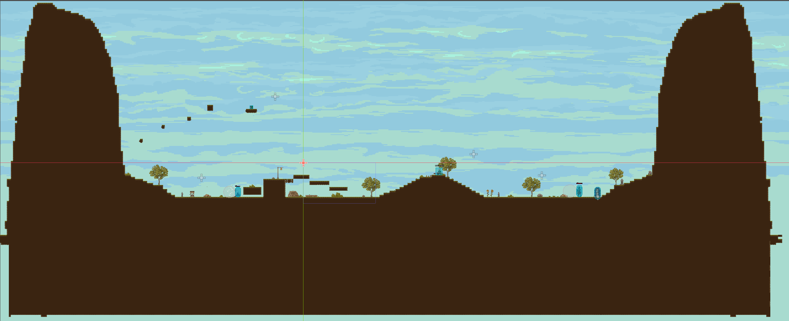
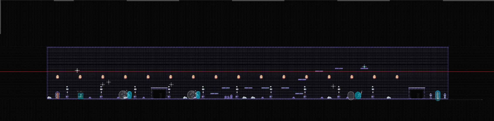
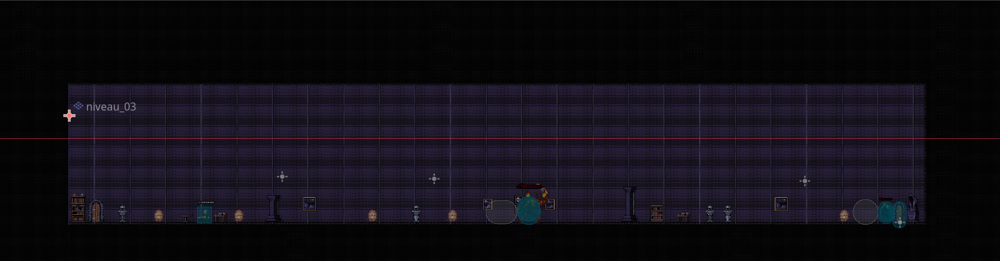

# lucas_bonneau_tp3


## but du jeu

le but est de tuer le méchant roi dans la salle du chateau 

## commande

bouger avec les touche **A** et **S** ou les **flèches directionelle**, attaquer **E** ou **clique gauche** de la souris, courrir avec **shift** et sauter avec **W** ou **spacebar**

## Premier niveau

mon premier niveau consiste en un petit combat 1vs1 contre un chevalier qui donnera une clé pour passé au prochain niveau


## Deuxième niveau

mon deuxième niveau a plusieurs enemies et la porte sera barré par une clé caché derrière un parcours, un enemie un peu plus puissant est dans se niveau et bloque la porte en plus de la clé 


## Troisième niveau

mon troisième niveau a un boss a tuer dans une salle de chateau, se boss est le roi et a plus de vie et attauqe plus souvent que les autres enemie


## Documentation 
```
 ┖╴Main
    ┠╴GameOver
    ┃  ┠╴background
    ┃  ┠╴StartButton
    ┃  ┠╴QuitButton
    ┃  ┠╴son_pause
    ┃  ┠╴son_depause
    ┃  ┠╴niveau_03
    ┃  ┃  ┖╴deco
    ┃  ┠╴niveau_01
    ┃  ┃  ┖╴arbre
    ┃  ┖╴Label2
    ┠╴Victory
    ┃  ┠╴background
    ┃  ┠╴StartButton
    ┃  ┠╴QuitButton
    ┃  ┠╴Label
    ┃  ┠╴son_pause
    ┃  ┠╴son_depause
    ┃  ┖╴niveau_01
    ┃     ┖╴arbre
    ┠╴NiveauContainer
    ┃  ┖╴niveau_01
    ┃     ┠╴background
    ┃     ┠╴niveau_01
    ┃     ┃  ┠╴arbre
    ┃     ┃  ┠╴botte
    ┃     ┃  ┃  ┠╴AnimatedSprite2D
    ┃     ┃  ┃  ┠╴CollisionShape2D
    ┃     ┃  ┃  ┖╴son_pick_up
    ┃     ┃  ┠╴door
    ┃     ┃  ┃  ┠╴AnimationDoor
    ┃     ┃  ┃  ┖╴CollisionDoor
    ┃     ┃  ┠╴Enemie
    ┃     ┃  ┃  ┠╴SpriteEnemie
    ┃     ┃  ┃  ┃  ┖╴BarreDeVie
    ┃     ┃  ┃  ┠╴MyHitBox
    ┃     ┃  ┃  ┃  ┖╴CollisionHit
    ┃     ┃  ┃  ┠╴MyHurtBox
    ┃     ┃  ┃  ┃  ┖╴CollisionHurt
    ┃     ┃  ┃  ┠╴CollisionSol
    ┃     ┃  ┃  ┠╴DirectionTimer
    ┃     ┃  ┃  ┠╴sword_attack
    ┃     ┃  ┃  ┖╴son_mort
    ┃     ┃  ┠╴Enemie02
    ┃     ┃  ┃  ┠╴SpriteEnemie
    ┃     ┃  ┃  ┃  ┖╴BarreDeVie
    ┃     ┃  ┃  ┠╴MyHitBox
    ┃     ┃  ┃  ┃  ┖╴CollisionHit
    ┃     ┃  ┃  ┠╴MyHurtBox
    ┃     ┃  ┃  ┃  ┖╴CollisionHurt
    ┃     ┃  ┃  ┠╴CollisionSol
    ┃     ┃  ┃  ┠╴DirectionTimer
    ┃     ┃  ┃  ┠╴sword_attack
    ┃     ┃  ┃  ┖╴son_mort
    ┃     ┃  ┖╴Alchemist
    ┃     ┃     ┠╴Panel2
    ┃     ┃     ┠╴Label2
    ┃     ┃     ┠╴Panel
    ┃     ┃     ┠╴Label
    ┃     ┃     ┠╴AnimationAlchemist
    ┃     ┃     ┠╴CollisionShape2D
    ┃     ┃     ┖╴son_pick_up
    ┃     ┖╴personnage_principal
    ┃        ┠╴perso_principal
    ┃        ┃  ┠╴HurtBox
    ┃        ┃  ┃  ┖╴CollisionHurt
    ┃        ┃  ┠╴HitBox
    ┃        ┃  ┃  ┖╴CollisionHit
    ┃        ┃  ┠╴BarreDeVie
    ┃        ┃  ┖╴Camera2D
    ┃        ┠╴CollisionSol
    ┃        ┠╴sword_attack
    ┃        ┖╴son_mort
    ┠╴menu_pause
    ┃  ┠╴Panel
    ┃  ┠╴Label
    ┃  ┠╴son_pause
    ┃  ┖╴son_depause
    ┖╴son_ambiant
```

- Le **main** charge le **game over**, le **victory**, le **niveau container** et **l'écran pause**
- Le **game over**, sert a faire une transition logique entre la mort du personnage et le début du niveau, le **background** et les **TileSet** servent de décors et les deux **boutons** servent a **quitter** ou a **rejouer**
- Le **victory**, sert a faire une fin au jeu, le **background** et les **TileSet** servent de décors et les deux **boutons** servent a **quitter** ou a **rejouer**
- le **niveau container**, est endroit où les **niveaux** vont être charger avec le **personnage principal**, les **enemies**, les **objets**, le **tilemap**, **l'alchemist**,etc
- Les **enemies** et le **personnage principal** ont un **CharacterBody2D** comme noeud principal, ensuite ils ont un **AnimatedSprite2D** pour créer les animations des personnages et dans **AnimatedSprite2D** il y a un autre **AnimatedSprite2D** pour créer la **barre de vie**, elle est a l'intérieur pour être obliger de suivre son parent, par la suite ils ont trois **Area2D** avec comme enfant une **CollisionShape2D** pour créer la **HitBox** qui sert a déterminer l'emplacement des attaques du personnage, après la **HurtBox** qui sert a déterminer la forme du corp et détecter si une **HitBox** la touche et la dernière la **CollisionSol** pour voir la forme du corp et l'empècher de passer a travers le sol. Pour finir, ils ont tous les **sons d'attaque et de mort**. PS: le **personnage principal** est le seul a avoir une **caméra** elle sert a suivre ses mouvements pendant la partie.
- le **menu pause**, sert a mettre sur pause le jeu, le **panel** fait un filtre gris pour indiquer la pause et le **label** écris pause sur l'écran 

## Crédit

- Personnage principale: https://luizmelo.itch.io/martial-hero
- enemie 01: https://szadiart.itch.io/2d-soulslike-character
- enemie 02: https://luizmelo.itch.io/fantasy-warrior
- enemie 03: https://luizmelo.itch.io/medieval-king-pack-2
- enemie 04: https://luizmelo.itch.io/hero-knight
- enemie 05: https://chierit.itch.io/boss-demon-slime
- alchemist: https://soulares.itch.io/free-npc-alchemist
- background: https://szadiart.itch.io/bakcground-hill
- tileset niveau 01: https://cainos.itch.io/pixel-art-platformer-village-props
- tileset niveau 02/03: https://raou.itch.io/dark-dun
- botte: https://clockworkraven.itch.io/raven-fantasy-icons
- barre de vie: https://toffeecraft.itch.io/dragon-hp-bar-free
- clé: https://drxwat.itch.io/pixel-art-key
- ui soundpack: https://cyrex-studios.itch.io/universal-ui-soundpack
- musique: https://rustedstudio.itch.io/free-music-lofi-tracks
